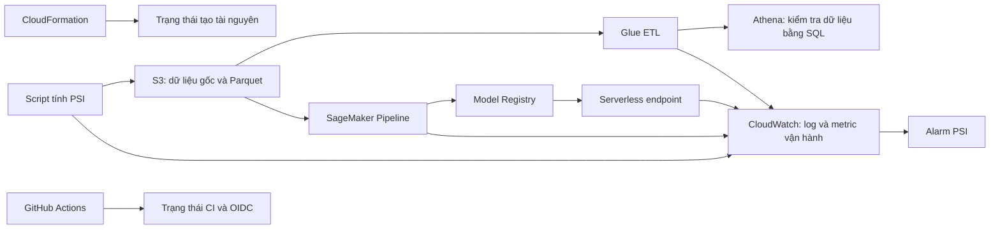

Trong hệ thống này, **observation** nghĩa là xem hệ thống có chạy đúng không, dữ liệu đi tới đâu, model cho kết quả thế nào và có cảnh báo bất thường không. Mỗi dịch vụ cho bạn một góc nhìn khác nhau; **CloudWatch không tự biết model phát hiện tấn công đúng hay sai**. Chất lượng model nằm trong báo cáo đánh giá của SageMaker trên S3.



## Thành phần nào quan sát thành phần nào?

| Nơi xem | Quan sát gì | Thông tin bạn nhận được | Hiện đã có? |
|---|---|---|---|
| **CloudFormation** | Các stack tạo S3, IAM, Glue, Athena, OIDC, alarm | Tài nguyên tạo thành công/thất bại; lỗi nằm ở bước nào | Có |
| **S3** | Dữ liệu và artifact | File raw, manifest, Parquet, model, báo cáo đánh giá và PSI có tồn tại không | Có; S3 là nơi lưu bằng chứng, không tự phát cảnh báo |
| **Glue Job runs** | Hai ETL NSL-KDD và UNSW-NB15 | `SUCCEEDED`/`FAILED`, thời gian chạy, lỗi đọc/biến đổi dữ liệu, log | Có |
| **Athena** | Bảng dữ liệu sau ETL | Số dòng, phân bố nhãn, kết quả SQL, lượng dữ liệu đã quét | Có; bạn phải chạy hoặc mở query, hiện chưa có alarm chất lượng dữ liệu |
| **SageMaker Pipelines** | Các bước preprocess → fit → evaluate → đăng ký model | Bước nào chạy thành công, job nào thất bại, ARN và output của từng bước | Có; RF và SVM đã thành công |
| **Model Registry** | Các phiên bản model | Version, trạng thái `Approved`/`Rejected`, liên kết tới artifact và evaluation | Có; RF v2 và SVM v2 được duyệt; v1 bị từ chối do lỗi inference |
| **CloudWatch Logs/Metrics** | Glue, SageMaker Processing và endpoint | Log lỗi, số request, lỗi 4xx/5xx, độ trễ, mức sử dụng endpoint | Log đã có; metric endpoint chỉ có dữ liệu khi endpoint chạy và nhận request |
| **CloudWatch Alarm** | Metric PSI do script công bố | PSI vượt `0,25` trong chu kỳ 5 phút hay không | Có; từng chuyển `ALARM` khi thử dữ liệu dịch chuyển giả lập |
| **GitHub Actions** | CI và việc assume AWS role bằng OIDC | Workflow xanh/đỏ, bước nào lỗi | Có; chưa có workflow tự động deploy AWS |
| **Billing/Budgets** | Chi phí AWS | Chi phí theo dịch vụ, cảnh báo vượt ngân sách | Bạn cần kiểm tra trong account; đây là quan sát chi phí, không phải kết quả model |

AWS xác nhận Glue job có trang theo dõi run và liên kết CloudWatch logs; SageMaker endpoint cũng có tab Monitoring và log group riêng. [Glue job monitoring](https://docs.aws.amazon.com/en_en/glue/latest/dg/view-job-runs.html), [SageMaker endpoint monitoring](https://docs.aws.amazon.com/sagemaker/latest/dg/manage-endpoints-console-monitoring.html).

## Cách xem trong AWS Console

Trước tiên, đăng nhập AWS Console và chọn **Region Asia Pacific (Singapore) — `ap-southeast-1`** ở góc phải. Nếu chọn Region khác, bạn sẽ thấy danh sách trống dù tài nguyên vẫn tồn tại.

### 1. Xem hạ tầng đã tạo

Vào **CloudFormation → Stacks**. Mở lần lượt:

- `bigdata-ids-dev-foundation`
- `bigdata-ids-dev-data`
- `bigdata-ids-dev-github-oidc`
- `bigdata-ids-dev-monitoring`

Trong mỗi stack, xem **Resources** để biết nó tạo dịch vụ nào, **Outputs** để lấy tên bucket/role, và **Events** khi cần tìm nguyên nhân thất bại. Events cho thấy tài nguyên nào lỗi và `Status reason`. [AWS: xem stack events](https://docs.aws.amazon.com/AWSCloudFormation/latest/UserGuide/view-stack-events.html).

### 2. Xem dữ liệu đầu vào và kết quả ETL

Vào **S3 → Buckets → `bigdata-ids-dev-foundation-databucket-y4img8enauch`**:

- `raw/dataset=nsl-kdd/version=v1/`: file NSL-KDD gốc và manifest.
- `raw/dataset=unsw-nb15/version=v1/`: file UNSW-NB15 gốc và manifest.
- `curated/`: dữ liệu Parquet sau Glue ETL.

S3 giúp xác nhận **file đã tới nơi**, còn để biết nội dung có đúng số dòng và nhãn hay không, hãy xem Athena.

Vào **AWS Glue → ETL jobs → Job run monitoring**. Chọn job `bigdata-ids-dev-data-nsl-kdd-etl` hoặc `bigdata-ids-dev-data-unsw-nb15-etl`, mở run gần nhất. Bạn sẽ thấy trạng thái, thời gian chạy và nút **View CloudWatch logs**. Nếu `FAILED`, mở error/output logs ở đó. [AWS: Glue job runs và logs](https://docs.aws.amazon.com/en_en/glue/latest/dg/view-job-runs.html).

### 3. Xem số liệu dữ liệu bằng Athena

Vào **Athena → Query editor**. Chọn workgroup `bigdata-ids-dev-data-athena`, database `bigdata_ids_dev`, rồi chạy:

```sql
SELECT binary_label, COUNT(*) AS so_dong
FROM flows_nsl_kdd
GROUP BY binary_label;
```

Kết quả đã kiểm chứng trước đó: **67.343 normal** và **58.630 attack** trong train NSL-KDD. Với UNSW, mở bảng `flows_unsw_nb15` để xem các loại tấn công. Tab **Recent queries** cho bạn xem query đã chạy, trạng thái, lỗi và lượng dữ liệu quét; lịch sử query trong Console được giữ 45 ngày. [AWS: Athena Recent queries](https://docs.aws.amazon.com/athena/latest/ug/queries-viewing-history.html).

### 4. Xem pipeline và chất lượng model

Vào **SageMaker AI → Pipelines → `bigdata-ids-dev-train` → Executions**. Mở execution RF `w53s4k21lvg6` hoặc SVM `bao44h4fqvdk`. Chọn từng step để xem `Succeeded`/`Failed` và Processing job tương ứng. Nếu job lỗi, mở liên kết CloudWatch logs; log của Processing job nằm trong `/aws/sagemaker/ProcessingJobs`. [AWS: pipeline executions](https://docs.aws.amazon.com/sagemaker/latest/dg/run-pipeline.html), [SageMaker log groups](https://docs.aws.amazon.com/sagemaker/latest/dg/logging-cloudwatch.html).

**Chất lượng model** được tính từ file `evaluation.json` trong S3 artifact bucket, không phải từ CloudWatch alarm:

| Model AWS | Accuracy trên KDDTest+ | F1 | FPR |
|---|---:|---:|---:|
| Random Forest | 0,7768 | 0,7625 | 0,0280 |
| SVM | 0,7266 | 0,7061 | 0,0756 |

Vào **SageMaker AI → Model Registry** để xem model group `bigdata-ids-dev-rf` và `bigdata-ids-dev-classical`. Phiên bản **v2** được duyệt; **v1** bị từ chối vì script inference cũ làm container không khởi động. Registry quản lý **phiên bản và quyết định duyệt**, không tự tính lại accuracy sau khi deploy. [AWS: Model Registry](https://docs.aws.amazon.com/sagemaker/latest/dg/model-registry-models.html).

### 5. Xem endpoint suy luận

Vào **SageMaker AI → Inference → Endpoints → `bigdata-ids-dev-rf`**. Trước hết xem **Status**. Lượt làm việc trước bị ngắt lúc tạo lại endpoint từ RF v2, nên cần kiểm tra trạng thái thực tế; chưa nên coi endpoint là đã phục vụ dự đoán.

Nếu endpoint hiện `InService`, mở tab **Monitoring** để xem `Invocations` (số request), lỗi 4xx/5xx và `ModelLatency`. Với serverless, có thể xem thêm thời gian khởi động model và mức dùng bộ nhớ. Khi lỗi khởi động, vào **CloudWatch → Logs → Log groups → `/aws/sagemaker/Endpoints/bigdata-ids-dev-rf`** để đọc traceback. [AWS: metric và log của serverless endpoint](https://docs.aws.amazon.com/sagemaker/latest/dg/serverless-endpoints-monitoring.html).

### 6. Xem drift và alarm

Vào **CloudWatch → Metrics → All metrics → `Capstone/IDS` → dimension `DatasetId=nsl-kdd` → `MaxPSI`**. Biểu đồ thể hiện giá trị PSI mà script đã công bố.

Sau đó vào **CloudWatch → Alarms → All alarms → `bigdata-ids-dev-monitoring-nsl-kdd-psi-critical`**. Xem trạng thái hiện tại và tab **History** để thấy lần chuyển sang `ALARM`. Alarm đã từng nhận giá trị **20,649132** từ dữ liệu **được cố ý dịch chuyển để thử hệ thống**. Nếu bây giờ alarm trở lại `OK`, điều đó phù hợp với cấu hình “không có datapoint mới thì không coi là lỗi”; xem **History** để thấy sự kiện cũ. Hiện alarm **chưa gửi email SNS**. [AWS: CloudWatch metrics](https://docs.aws.amazon.com/AmazonCloudWatch/latest/monitoring/viewing_metrics_with_cloudwatch.html), [alarm history](https://docs.aws.amazon.com/AmazonCloudWatch/latest/monitoring/CloudWatch_Alarms.html).

**Ba điều cần nhớ khi trình bày capstone:** Athena chứng minh dữ liệu ETL và truy vấn được; evaluation JSON chứng minh chất lượng model trên tập test; CloudWatch chứng minh hệ thống chạy và phát hiện drift. Alarm PSI không chứng minh một network flow là tấn công, và metric từ tập test không phải chất lượng đo trên traffic thật.