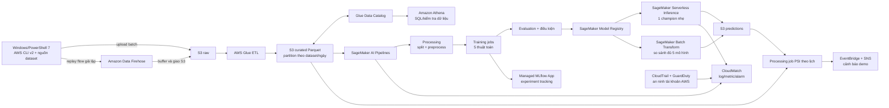

# Thiết kế hệ thống Big Data + MLOps + Cybersecurity trên AWS

**Trạng thái:** thiết kế đề xuất, chưa triển khai hoặc đo kiểm trên tài khoản AWS  
**Đối tượng:** capstone sinh viên; nhóm phát triển dùng Windows, PowerShell 7 và AWS CLI v2  
**Mục tiêu ưu tiên:** đưa một luồng dữ liệu và một mô hình hoạt động đầu cuối lên AWS nhanh; sau đó mở rộng thành so sánh năm thuật toán và nhiều bộ dữ liệu mà không làm phình hạ tầng chạy thường trực.

Hướng dẫn thực hiện và phân công: [DEPLOYMENT_RUNBOOK.md](./DEPLOYMENT_RUNBOOK.md). Nếu đây là lần đầu dùng AWS/GitHub Actions, bắt đầu với [BEGINNER_AWS_GITHUB_GUIDE.md](./BEGINNER_AWS_GITHUB_GUIDE.md).

## 1. Phạm vi và nguyên tắc

Hệ thống nhận dữ liệu network flow công khai, lưu bản gốc và dữ liệu đã chuẩn hóa trong data lake, huấn luyện/đánh giá mô hình IDS, quản lý phiên bản, chạy suy luận, theo dõi drift và phát cảnh báo. Đây là **môi trường nghiên cứu và trình diễn phát hiện xâm nhập**. Không xem dự đoán từ bộ dữ liệu công khai là cảm biến IDS đang bảo vệ một VPC thực; không tự động chặn IP hoặc thay đổi chính sách mạng dựa trên dự đoán demo.

Repo tham khảo [machetheDM/ml-ids-zero-trust-cloud](https://github.com/machetheDM/ml-ids-zero-trust-cloud) đã có mã preprocessing NSL-KDD, năm thuật toán Random Forest, SVM, LSTM, Autoencoder, XGBoost, MLflow, FastAPI, PSI và GitHub Actions. Tận dụng mã và cấu hình này như **điểm xuất phát**, không coi image, model artifact hay pipeline local là tương thích AWS ngay. Các con số LSTM 98,1% accuracy/1,8% FPR và XGBoost 97,3% accuracy/1,9% FPR là **kết quả tác giả công bố trong README**, chưa được capstone tái lập. Bảng kết quả capstone chỉ điền sau khi chạy lại trên tập dữ liệu, seed, split và môi trường được ghi nhận. [Nguồn: README repo tham khảo](https://github.com/machetheDM/ml-ids-zero-trust-cloud).

### Yêu cầu chức năng

1. Nạp NSL-KDD và ít nhất một bộ dữ liệu thứ hai; lưu nguồn, phiên bản và checksum.
2. Truy vấn, tổng hợp và kiểm tra chất lượng dữ liệu bằng SQL trên data lake.
3. Huấn luyện/đánh giá năm thuật toán trên NSL-KDD theo cùng giao thức đánh giá; lưu experiment, artifact và phiên bản mô hình.
4. Cung cấp suy luận tương tác cho một mô hình được chọn và suy luận theo lô cho các mô hình còn lại.
5. Theo dõi chất lượng vận hành, PSI và tỷ lệ dự đoán; cảnh báo khi vượt ngưỡng. Chỉ đánh giá performance drift khi có nhãn thật.
6. Ghi vết triển khai, vận hành và truy cập dữ liệu; phân quyền tối thiểu; tái tạo được demo từ mã nguồn và cấu hình.

### Phi chức năng và giới hạn

Ưu tiên dịch vụ quản lý, job chạy theo nhu cầu và chi phí có thể tắt sau buổi demo. Dữ liệu NSL-KDD tương đối nhỏ: nó chứng minh **kiến trúc Big Data có thể mở rộng**, không tự nó chứng minh thông lượng Big Data. Báo cáo phải nêu rõ khối lượng dữ liệu đã chạy, thời gian, chi phí và giới hạn; không ngoại suy các chỉ số này thành hiệu năng production.

## 2. Kiến trúc tổng thể



**Đường dữ liệu:** ingest → raw bất biến → ETL/curated → SQL và huấn luyện → registry → suy luận → dự đoán/PSI/cảnh báo. **Đường điều khiển:** GitHub Actions hoặc máy Windows gọi AWS CLI để tạo/cập nhật hạ tầng, khởi chạy pipeline và kiểm tra trạng thái. Không đặt khóa AWS trong repo hay file workflow.

**Ranh giới trách nhiệm:** mô hình IDS phân loại network flow trong dataset; GuardDuty phát hiện một số mối đe dọa đối với tài khoản/tài nguyên AWS; CloudTrail ghi nhận hoạt động API. Ba nguồn này bổ sung cho nhau, không thay thế nhau. Đầu vào replay qua Firehose là lưu lượng **giả lập từ dữ liệu lịch sử**, không phải bắt gói mạng trực tiếp.

## 3. Thành phần, nhiệm vụ và lựa chọn dịch vụ

| Thành phần | Vai trò và chức năng cụ thể | Lý do chọn / phạm vi |
|---|---|---|
| **Amazon S3** | Data lake: `raw/`, `curated/`, `features/`, `artifacts/`, `predictions/`, `drift/`; lưu checksum/manifest và bật versioning cho dữ liệu/artifact quan trọng. | Nền lưu trữ dùng chung cho Glue, Athena, SageMaker; tách prefix và quyền theo vai trò. |
| **Amazon Data Firehose** | Nhận các record JSON từ công cụ replay trên Windows; buffer, ghi theo lô vào S3 và đưa record lỗi sang prefix lỗi. | Có nhánh streaming dễ demo mà không vận hành broker. Upload file lớn trực tiếp S3; Firehose không phải hệ thống replay lâu dài. [AWS CLI PutRecordBatch](https://docs.aws.amazon.com/cli/latest/reference/firehose/put-record-batch.html). |
| **AWS Glue ETL + Data Catalog** | Kiểm tra schema, làm sạch, thống nhất tên cột/nhãn trong từng dataset, xuất Parquet; catalog bảng `flows_nsl_kdd`, `flows_unsw_nb15` và partitions. | ETL theo job, không duy trì cluster. Crawler chỉ dùng để khám phá ban đầu; production/demo ổn định nên định nghĩa schema và partition rõ ràng. [Glue/Athena crawler](https://docs.aws.amazon.com/athena/latest/ug/schema-crawlers.html). |
| **Amazon Athena** | SQL kiểm tra số dòng, phân bố nhãn, null, trùng, tỷ lệ attack, dữ liệu theo ngày; làm nguồn bảng/ảnh báo phân tích. | Không cần dựng kho dữ liệu. Đọc đúng partition để giảm dữ liệu quét. [Athena partitions](https://docs.aws.amazon.com/athena/latest/ug/partitions.html). |
| **SageMaker AI Pipelines** | Điều phối Processing → Training → Evaluation → Condition → Register; ghi tham số, đầu vào, đầu ra và trạng thái từng lần chạy. | Một nơi quản lý vòng đời ML thay vì kéo nhiều dịch vụ orchestration vào MVP. [Pipelines overview](https://docs.aws.amazon.com/sagemaker/latest/dg/pipelines-overview.html). |
| **SageMaker Processing** | Chạy mã `preprocess.py` sau khi tách train/validation/test; tạo feature schema, encoder/scaler/selector và dữ liệu đầu vào cho từng mô hình; chạy job PSI định kỳ. | Tái sử dụng Python hiện có trong job theo nhu cầu. |
| **SageMaker Training** | Chạy container/script huấn luyện cho RF, SVM, XGBoost, LSTM, Autoencoder; lưu model artifact lên S3. | Tài nguyên tính toán cấp theo từng job; LSTM/Autoencoder có thể cần image/thư viện riêng và chọn instance sau benchmark. [Training workflow](https://docs.aws.amazon.com/sagemaker/latest/dg/train-model.html). |
| **SageMaker managed MLflow App** | Ghi run, tham số, metric, artifact và liên kết `dataset_version`, `git_sha`, `feature_schema_version`. | Gần với MLflow local của repo. AWS hiện khuyến nghị MLflow App thay cho tracking server đời trước. Kiểm tra tính sẵn có của dịch vụ ở Region đã chọn trước khi chốt. [AWS MLflow App](https://docs.aws.amazon.com/sagemaker/latest/dg/mlflow-app-setup.html). |
| **SageMaker Model Registry** | Lưu version mô hình và metric/evaluation, trạng thái phê duyệt, ARN artifact; chỉ bản đạt gate mới được gán champion/deploy. | Tạo ranh giới rõ giữa huấn luyện và phát hành. Đồng bộ tự động từ MLflow sang Registry là tùy chọn phải bật; không giả định có sẵn. [AWS Registry sync](https://docs.aws.amazon.com/sagemaker/latest/dg/mlflow-track-experiments-model-registration.html). |
| **SageMaker Serverless Inference** | Phục vụ **một mô hình nhẹ được chọn sau đo kiểm** (ưu tiên RF/XGBoost) cho vài request tương tác trong demo; ghi request/prediction ID ra S3 qua lớp gọi API hoặc script. | Không cần endpoint instance chạy thường trực. Có cold start, giới hạn bộ nhớ; không phù hợp mặc định cho LSTM lớn hoặc yêu cầu GPU. **Không có data capture/Model Monitor tích hợp** theo feature matrix của AWS. [Hosting options](https://docs.aws.amazon.com/sagemaker/latest/dg/hosting-faqs.html), [feature matrix](https://docs.aws.amazon.com/sagemaker/latest/dg/model-deploy-feature-matrix.html). |
| **SageMaker Batch Transform** | Chạy cùng tập test qua cả năm phiên bản model; lưu prediction, latency/throughput của job và đối chiếu nhãn. | Đường chính để chứng minh đa thuật toán mà không trả tiền cho năm endpoint đồng thời. [Hosting options](https://docs.aws.amazon.com/sagemaker/latest/dg/hosting-faqs.html). |
| **EventBridge Scheduler + SNS** | Theo lịch gọi `StartPipelineExecution` cho một **pipeline drift riêng** chỉ gồm Processing và bước ghi metric; CloudWatch alarm gửi SNS cho thành viên nhóm đã đăng ký. | Không cần Lambda chỉ để khởi chạy job; PSI cao kích hoạt **xem xét**, không tự động retrain/deploy. [AWS schedule pipeline](https://docs.aws.amazon.com/sagemaker/latest/dg/pipeline-eventbridge.html). |
| **CloudWatch** | Lưu log job, metric endpoint, alarm lỗi/latency và dashboard vận hành. | Bằng chứng demo và chẩn đoán thất bại. Serverless endpoint có metric riêng, bao gồm cold start/overhead. [AWS monitoring](https://docs.aws.amazon.com/sagemaker/latest/dg/serverless-endpoints-monitoring.html). |
| **IAM, KMS, CloudTrail, GuardDuty** | IAM cấp quyền theo service role; KMS mã hóa khi cần kiểm soát khóa; CloudTrail audit API; GuardDuty cảnh báo rủi ro AWS thực. | Lớp bảo vệ và audit của chính môi trường capstone; không gộp metric GuardDuty với accuracy IDS. |
| **GitHub Actions + IaC** | Kiểm tra code/config, đóng gói image và gọi lệnh triển khai AWS bằng identity ngắn hạn qua OIDC; gắn phiên bản image/commit. | Tái dùng workflow repo sau chỉnh sửa. Dùng CloudFormation/CDK/Terraform tùy năng lực nhóm, chọn **một** công cụ IaC. |

**Không đưa vào MVP:** Kinesis Data Streams/MSK, EMR, Redshift, EKS, Step Functions và năm endpoint online. Chỉ thêm Kinesis Data Streams khi cần nhiều consumer độc lập và replay theo offset; Firehose hiện đủ cho luồng đưa dữ liệu vào S3. Dashboard trực quan có thể làm bằng Athena saved queries/CloudWatch trước, QuickSight hoặc Streamlit sau khi đường dữ liệu hoạt động.

## 4. Thiết kế dữ liệu và đa dataset

| Dataset | Vai trò | Quy tắc tích hợp |
|---|---|---|
| **NSL-KDD** | Dataset chính để chạy lại năm thuật toán của repo và đối chiếu phương pháp. | Giữ nguyên bản raw; định nghĩa nhãn binary và attack family; lưu split ID cố định, seed và mã preprocessing. Không lấy benchmark README làm kết quả capstone. |
| **UNSW-NB15** | Dataset thứ hai cho phân tích Big Data, đánh giá khả năng mở rộng và **thử nghiệm ngoài miền**. Nguồn chính thức mô tả 49 feature và hơn 2,5 triệu record ở bốn file CSV; có train/test dựng sẵn. | Không đưa trực tiếp vào model NSL-KDD vì schema/ý nghĩa feature khác. Tạo pipeline feature riêng, train lại baseline RF/XGBoost, hoặc chỉ so sánh phân bố/khả năng xử lý nếu thời gian hạn chế. Tuân thủ điều kiện sử dụng và trích dẫn. [UNSW Research](https://research.unsw.edu.au/projects/unsw-nb15-dataset). |
| **CIC-IDS2017** *(mở rộng)* | Thử nghiệm dữ liệu flow và loại tấn công khác; dùng CSV trước PCAP để rút ngắn thời gian. | Không giả định feature tương đương NSL-KDD/UNSW. Bắt đầu với tập con có nguồn và ngày rõ ràng; kiểm tra license và kích thước trước tải. [Canadian Institute for Cybersecurity](https://www.unb.ca/cic/datasets/ids-2017.html). |

**Hợp đồng dữ liệu tối thiểu:** mỗi record lưu `dataset_id`, `dataset_version`, `source_file`, `ingest_time`, `event_time` (nếu nguồn có), `flow_id`, `raw_label` (nếu có), `binary_label` (chỉ trong tập có nhãn), `feature_schema_version` và các feature theo schema riêng. Không đưa `raw_label`, `binary_label`, tên file, ID hoặc timestamp suy ra nhãn vào vector suy luận. `flow_id` phục vụ nối prediction với nhãn đến sau và khử trùng lặp; quy tắc tạo ID phải cố định theo nguồn.

**Bố trí S3 đề xuất:**

```text
s3://<bucket>/raw/dataset=<id>/version=<v>/...
s3://<bucket>/curated/dataset=<id>/year=<yyyy>/month=<mm>/day=<dd>/...
s3://<bucket>/features/dataset=<id>/schema=<v>/split=<train|val|test>/...
s3://<bucket>/artifacts/model=<name>/run=<id>/...
s3://<bucket>/predictions/model=<name>/run=<id>/...
s3://<bucket>/drift/model=<name>/date=<yyyy-mm-dd>/...
```

Raw là bản sao chỉ thêm mới. Curated dùng Parquet; partition theo dataset/ngày, **không partition theo nhãn** nếu điều đó khiến test/inference lộ thông tin. Một manifest chứa URI, checksum SHA-256, số record, schema version và license/citation. Thiết lập lifecycle/retention sau khi thống nhất nhu cầu giữ bằng chứng, tránh xóa artifact trước bảo vệ capstone.

## 5. Thiết kế MLOps và kiểm định mô hình

### 5.1 Tái sử dụng mã nguồn

| Phần repo tham khảo | Cách đưa lên AWS | Việc cần kiểm tra trước khi chạy |
|---|---|---|
| `src/preprocess.py` | Chạy trong Processing job; đọc input từ S3 và xuất dữ liệu + preprocessor artifact lên S3. | Tách dữ liệu **trước** khi fit OHE/scaler/RFECV/SMOTE; chỉ fit trên train và áp dụng cho validation/test. Xác nhận hình dạng feature thực tế của từng mô hình. |
| `src/models.py`, `src/train_mlflow.py`, `src/evaluate.py` | Tách tham số model/job; Training jobs; log MLflow; Evaluation job sinh JSON chuẩn. | Pin phiên bản Python/thư viện, seed, class mapping và serialization; bảo đảm metric được tính trên test không dùng trong tuning. |
| `api/serve.py` | Giữ làm demo local/adapter tùy chọn; lấy preprocessing và model theo đúng version từ Registry/S3. | FastAPI container hiện tại không tự trở thành SageMaker endpoint. Với MVP dùng inference handler của SageMaker; nếu cần giữ chính xác REST path của FastAPI, triển khai adapter riêng sau. |
| `src/drift_monitor.py`, `dashboard/drift_app.py` | Processing job theo lịch đọc reference và cửa sổ prediction/input trên S3; xuất JSON/CSV, CloudWatch metric và SNS alarm. | Ngưỡng PSI repo là tham khảo; hiệu chỉnh theo dữ liệu và tần suất. Không gọi prediction drift là concept drift nếu chưa có nhãn. |
| `.github/workflows/ml-pipeline.yml` | CI cho lint/test/build/IaC; AWS pipeline chịu trách nhiệm chạy ML. | Dùng GitHub OIDC, tránh lưu access key dài hạn; giới hạn quyền role và nhánh được assume. |

**Kiểm tra phương pháp bắt buộc:** README nêu 25 feature được chọn nhưng mô tả Autoencoder dạng `41→32→16→8`; xác nhận chính xác input contract của từng model và đóng gói preprocessor chung với artifact tương ứng. LSTM trên từng dòng NSL-KDD không tự chứng minh khả năng học chuỗi thời gian; chỉ mô tả là mô hình deep learning cho dữ liệu đã sắp xếp thành chuỗi khi cách tạo sequence và split theo phiên/thời gian được kiểm chứng. Nếu không, báo cáo LSTM theo đúng input được tái lập và nêu hạn chế.

### 5.2 Pipeline và gate phát hành

1. **Ingest/validate:** checksum, schema, giá trị thiếu, nhãn, tỷ lệ trùng; file lỗi vào prefix quarantine và báo cáo lý do.
2. **Split/preprocess:** dùng split có thể tái lập; tránh cùng flow/phiên xuất hiện ở cả train và test. Fit biến đổi/SMOTE/RFECV trên train; lưu preprocessor version và feature order.
3. **Train:** năm job hoặc bước có tham số `model_name`; log code commit, dataset version, seed, hyperparameter, thời gian và tài nguyên. Huấn luyện Autoencoder theo tập normal nếu đó là thiết kế đã xác minh.
4. **Evaluate:** confusion matrix, precision/recall/F1 theo lớp, FPR, PR-AUC/ROC-AUC khi có score, thời gian train và latency inference; thêm metric theo attack family. Chọn champion theo tiêu chí đã chốt **trước khi xem test**, ví dụ FPR tối đa và recall tối thiểu do nhóm đặt; không chép ngưỡng của tác giả thành kết quả.
5. **Register/approve:** chỉ version đạt gate và có đủ metadata mới được đề xuất; một người trong nhóm duyệt thủ công việc deploy. Lưu model package ARN và preprocessor cùng version.
6. **Deploy/rollback:** cập nhật endpoint thử nghiệm bằng version đã duyệt; chạy smoke test payload hợp lệ/sai schema; giữ package và endpoint config trước để rollback. Với serverless, thử cold start và bộ nhớ bằng đo thực tế.

MLflow dùng cho **theo dõi thí nghiệm**; SageMaker Model Registry là **nguồn sự thật cho bản deploy**. Có thể bật đồng bộ giữa hai nơi, nhưng cần cấu hình và kiểm tra quyền/metadata cụ thể. [AWS MLflow–Registry integration](https://docs.aws.amazon.com/sagemaker/latest/dg/mlflow-track-experiments-model-registration.html).

### 5.3 Suy luận và drift

API hoặc script demo gửi `model_version`, `feature_schema_version`, `flow_id` và vector feature đúng thứ tự. Từ chối thiếu cột, sai kiểu, NaN/Infinity và schema không khớp. Prediction trả `flow_id`, model version, nhãn, score nếu thuật toán hỗ trợ và thời gian. Kết quả được ghi S3 cùng input tối thiểu cần thiết cho audit/drift; tránh lưu payload nhạy cảm không cần thiết.

Job drift theo lịch so sánh phân bố feature của **cùng dataset/schema/preprocessor** với reference train và cửa sổ mới. Ghi PSI từng feature, tỷ lệ nhãn dự đoán, kích thước mẫu và tỷ lệ record lỗi. Ngưỡng tham khảo của repo (`0,10` cảnh báo; `0,25` nghiêm trọng) chỉ để demo, cần kiểm tra độ ổn định theo cỡ mẫu. Nhãn thật có thể tới muộn; chỉ khi có nhãn mới tính lại FPR/recall và xét retrain. SageMaker Serverless Inference không có Model Monitor tích hợp; AWS cũng [ghi Model Monitor không mở cho khách hàng mới](https://docs.aws.amazon.com/sagemaker/latest/dg/model-monitor-data-capture-endpoint.html). Vì vậy đường S3 + Processing + CloudWatch ở đây là **thiết kế chủ động**, không phải tính năng Model Monitor mặc định. [AWS feature matrix](https://docs.aws.amazon.com/sagemaker/latest/dg/model-deploy-feature-matrix.html).

## 6. Cybersecurity và vận hành AWS

- **Danh tính:** tài khoản cá nhân/SSO cho thành viên; không dùng root cho công việc thường ngày. Tách role CI, Glue, SageMaker Processing/Training, endpoint và người duyệt; giới hạn action theo bucket prefix, ECR repo, model group và Region. GitHub Actions assume role qua OIDC với trust policy gắn repo/branch cụ thể.
- **Dữ liệu:** S3 Block Public Access, TLS, mã hóa tại chỗ (SSE-S3 cho MVP; SSE-KMS khi cần chứng minh quản lý khóa riêng), versioning và bucket policy chặn truy cập công khai. Không đưa credentials, IP thật hoặc payload nhạy cảm vào repo/log.
- **Mạng:** ưu tiên endpoint/private subnet cho job và quyền truy cập dữ liệu khi phạm vi cho phép; lập bảng chi phí VPC endpoint/NAT trước khi bật. Serverless Inference có giới hạn tính năng mạng so với real-time endpoint, nên không mô tả nó như endpoint đặt trong VPC riêng. [AWS feature matrix](https://docs.aws.amazon.com/sagemaker/latest/dg/model-deploy-feature-matrix.html).
- **Audit và bảo vệ:** CloudTrail cho API activity; CloudWatch cho log/metric/alarm; GuardDuty cho phát hiện đe dọa môi trường AWS. Mô hình IDS demo không thay thế các dịch vụ này. Cảnh báo nghiêm trọng cần con người xác minh trước hành động.
- **Nguồn cung phần mềm:** pin dependency và image digest, quét image ECR, chỉ tải model artifact từ vị trí được cấp quyền. File `.pkl`/pickle chỉ load từ nguồn tin cậy vì có thể thực thi mã khi deserialize.
- **Chi phí:** AWS Budgets với mức cảnh báo được nhóm xác định; gắn tag `Project`, `Owner`, `Environment`, `ExpiresOn`; đặt thời gian giữ CloudWatch Logs; xóa endpoint/app và resource thử nghiệm sau demo theo runbook. Báo cáo chi phí thực từ Billing/Cost Explorer, không ước đoán bằng giá cố định trong thiết kế.

## 7. Trình tự triển khai ngắn nhất

| Giai đoạn | Kết quả có thể trình diễn | Tiêu chí hoàn thành |
|---|---|---|
| **0. Chốt môi trường** | Chọn Region có các dịch vụ cần dùng; xác nhận quota, ngân sách và quyền; `aws sts get-caller-identity` từ PowerShell 7. | Một tài khoản/Region, naming/tagging và sơ đồ quyền được ghi lại. |
| **1. Data lake** | S3 raw/curated, nạp NSL-KDD; Glue ETL/Catalog; Athena query số dòng/phân bố nhãn. | Query khớp manifest; có log file lỗi và version dữ liệu. |
| **2. ML đầu cuối** | Processing + Training + Evaluation + Model Registry cho RF/XGBoost; MLflow App ghi run. | Chạy lại từ input S3, lưu metric **tự đo**, model và preprocessor cùng version. |
| **3. Demo vận hành** | Một serverless endpoint; batch transform; CloudWatch; job PSI theo lịch; SNS cảnh báo. | Request đúng/sai schema, prediction có version, alarm thử nghiệm và rollback được ghi bằng chứng. |
| **4. Mở rộng capstone** | SVM, LSTM, Autoencoder; UNSW-NB15, tùy thời gian thêm CIC-IDS2017; so sánh chi phí/chất lượng. | Có bảng kết quả năm model trên NSL-KDD và thí nghiệm dataset thứ hai được phân biệt rõ. |

Thứ tự này đảm bảo nhóm có đường demo hoàn chỉnh sớm. Nếu MLflow App không sẵn có ở Region/quota đã chọn, vẫn chạy SageMaker Pipelines + Model Registry và log metric/artifact vào SageMaker/S3; ghi rõ việc hoãn MLflow trong báo cáo. Nếu endpoint serverless không vừa model hoặc cold start ảnh hưởng demo, dùng RF/XGBoost đã benchmark hoặc Batch Transform; chuyển real-time endpoint chỉ khi có yêu cầu latency và ngân sách rõ ràng.

### Thao tác mẫu từ Windows

Các lệnh sau minh họa điểm bắt đầu bằng PowerShell 7; tên profile, bucket và đường dẫn do nhóm cấu hình, không chép credential vào script. Lệnh tạo tài nguyên nên nằm trong IaC; CLI dùng để kiểm tra và chạy demo.

```powershell
$env:AWS_PROFILE = "capstone-dev"
$bucketName = "ten-bucket-cua-nhom"
$datasetFile = ".\data\KDDTrain+.txt"
aws sts get-caller-identity
aws configure get region
Get-FileHash -Algorithm SHA256 -Path $datasetFile
aws s3 cp $datasetFile "s3://$bucketName/raw/dataset=nsl-kdd/version=v1/KDDTrain+.txt"
```

Sau khi upload, ghi checksum SHA-256 từ `Get-FileHash` vào manifest rồi mới khởi chạy pipeline với `dataset_version=v1`. Trong PowerShell, dùng file JSON UTF-8 và tham số `file://` cho payload dài của AWS CLI v2 để tránh lỗi escape dấu nháy; nếu demo Firehose, kiểm tra `FailedPutCount` và retry **chỉ** record thất bại, đồng thời khử trùng lặp ở đích. [AWS CLI Firehose PutRecordBatch](https://docs.aws.amazon.com/cli/latest/reference/firehose/put-record-batch.html).

### Đầu ra nên có trong repo capstone

```text
infra/                 # một công cụ IaC duy nhất
src/data/              # ingest, validate, ETL, manifest
src/ml/                # adapter preprocessing, train, evaluate, inference
src/monitoring/        # PSI, metric, alarm
pipelines/             # định nghĩa SageMaker Pipeline
configs/               # dataset/model/schema/threshold theo environment
docs/                  # ADR, sơ đồ, runbook, chi phí, kết quả
.github/workflows/     # CI và quy trình deploy
```

### Bằng chứng nghiệm thu

1. Ảnh/chụp lệnh: S3 raw/curated, Athena query, Glue job thành công.
2. SageMaker Pipeline execution có đủ step và MLflow run/Registry version khớp `git_sha` + `dataset_version`.
3. Bảng năm thuật toán ghi **metric capstone tự đo**, split/seed, input schema, instance, thời gian và chi phí; cột riêng cho số tác giả công bố nếu cần đối chiếu.
4. Một request suy luận tương tác và một batch job, mỗi prediction có model version; thử một payload sai schema.
5. PSI/cảnh báo giả lập, CloudWatch alarm/log, CloudTrail event; mô tả ai nhận và xử lý cảnh báo.
6. Runbook tái tạo, rollback, dừng/xóa resource, và báo cáo chi phí thực tế.

## 8. Quyết định còn cần đo hoặc chốt

| Quyết định | Cách chốt |
|---|---|
| Region và quota SageMaker/MLflow App | Kiểm tra bằng AWS CLI/console trong tài khoản nhóm trước tạo hạ tầng; ghi Region vào cấu hình. |
| Mô hình online | Đo kích thước artifact, RAM, cold start và latency của RF/XGBoost; chọn một bản đạt mục tiêu demo. |
| Gate metric | Ghi mục tiêu recall/FPR và class ưu tiên trước khi chạy test; dùng FPR và recall theo lớp thay vì accuracy đơn lẻ. |
| Tập UNSW-NB15 | Chọn toàn bộ train/test dựng sẵn hay subset có seed; không gộp feature thô với NSL-KDD. |
| Dashboard | Athena/CloudWatch đủ cho MVP; chỉ thêm QuickSight/Streamlit nếu còn thời gian và ngân sách. |
| Ngân sách và thời gian lưu | Nhóm điền mức ngân sách, ngưỡng cảnh báo, Region, lịch bật/tắt endpoint và thời hạn giữ dữ liệu. |

## Tài liệu nguồn chính

- [Repo tham khảo và README](https://github.com/machetheDM/ml-ids-zero-trust-cloud).
- [AWS SageMaker Pipelines](https://docs.aws.amazon.com/sagemaker/latest/dg/pipelines-overview.html), [MLflow App](https://docs.aws.amazon.com/sagemaker/latest/dg/mlflow-app-setup.html), [Model Registry sync](https://docs.aws.amazon.com/sagemaker/latest/dg/mlflow-track-experiments-model-registration.html), [inference feature matrix](https://docs.aws.amazon.com/sagemaker/latest/dg/model-deploy-feature-matrix.html).
- [AWS Firehose PutRecordBatch](https://docs.aws.amazon.com/cli/latest/reference/firehose/put-record-batch.html), [Athena partitions](https://docs.aws.amazon.com/athena/latest/ug/partitions.html).
- [UNSW-NB15 official dataset](https://research.unsw.edu.au/projects/unsw-nb15-dataset), [CIC-IDS2017 official dataset](https://www.unb.ca/cic/datasets/ids-2017.html).
