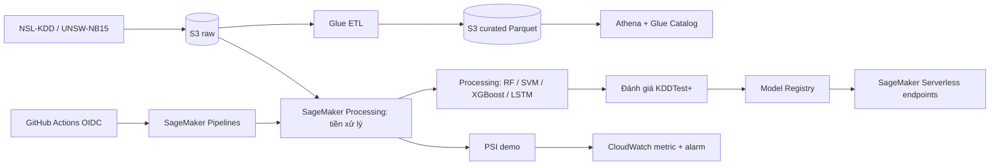

# Developer guide — Big Data + MLOps IDS trên AWS

**Đối tượng:** thành viên nhóm phát triển, dùng Windows, PowerShell 7, Python 3.11 và AWS CLI v2. **Phạm vi:** fork `galaxyofmind/ml-ids-zero-trust-cloud`, AWS account `101728439989`, Region `ap-southeast-1`. Trạng thái vận hành và kết quả đo xem [Operations runbook](OPERATIONS_RUNBOOK.md) và [Deployment report](DEPLOYMENT_REPORT.md).

## 1. Mô hình hệ thống đang được triển khai



`infra/foundation.yaml` tạo hai bucket và service roles; `infra/data.yaml` tạo Glue/Athena; `infra/github-oidc.yaml` tạo role cho GitHub; `infra/monitoring.yaml` tạo alarm. Firehose là tuỳ chọn trong template và **chưa chạy** ở account này. `FastAPI`, `MLflow`, dashboard và Autoencoder trong repo gốc là phần local, chưa được triển khai thành dịch vụ AWS.

## 2. Bắt đầu trên máy phát triển

1. Mở PowerShell 7 tại thư mục gốc repo. Kiểm tra `git status`, `py -3.11 --version`, `aws --version` và `aws configure list-profiles`. Không ghi access key vào mã, file Markdown hoặc GitHub Secrets. Nếu profile AWS đang thiếu, cấu hình cục bộ theo hướng dẫn nội bộ của nhóm; không gửi khóa qua chat.
2. Tạo môi trường tối thiểu cho các script AWS. `requirements.txt` của upstream phục vụ cả notebook/API/MLflow và có phạm vi lớn hơn nhu cầu deploy.

   ```powershell
   py -3.11 -m venv .venv
   .\.venv\Scripts\python.exe -m pip install --upgrade pip
   .\.venv\Scripts\python.exe -m pip install 'sagemaker==2.257.5' 'botocore[crt]' 'scikit-learn==1.4.2' pandas numpy joblib
   ```

3. Kiểm tra đúng account trước mọi thay đổi. Profile `default` ở phiên triển khai đã xác nhận là root theo yêu cầu của chủ account; mỗi script yêu cầu `-AllowRoot` hoặc `--allow-root` nếu dùng nó. Khi chuyển sang IAM role/user đủ quyền, đổi `-Profile`/`--profile` và bỏ cờ root.

   ```powershell
   $awsProfile = 'default'
   $awsRegion = 'ap-southeast-1'
   $identity = aws sts get-caller-identity --profile $awsProfile --region $awsRegion --output json | ConvertFrom-Json
   if ($identity.Account -ne '101728439989') { throw "Sai AWS account: $($identity.Account)" }
   $identity.Arn
   ```

4. `data/KDDTrain+.txt` và `data/KDDTest+.txt` phải có trên máy để chạy smoke test. Chúng được `.gitignore` loại khỏi Git. Bản gốc đã có trong S3; khi cần tải về, dùng bucket của foundation stack và kiểm tra SHA-256 theo [deployment report](DEPLOYMENT_REPORT.md#2-dataset-và-big-data):

   ```powershell
   Get-FileHash -Algorithm SHA256 .\data\KDDTrain+.txt
   Get-FileHash -Algorithm SHA256 .\data\KDDTest+.txt
   ```

   Không trộn dữ liệu UNSW-NB15 vào model NSL-KDD.

## 3. Bản đồ mã nguồn và hợp đồng dữ liệu

| Vị trí | Vai trò | Điều cần giữ khi sửa |
|---|---|---|
| `glue/nsl_kdd_etl.py`, `glue/unsw_etl.py` | Chuẩn hoá hai bộ dữ liệu riêng và ghi Parquet | Giữ schema, partition/path và bảng Glue khớp nhau. |
| `src/sagemaker_preprocess.py` | Đọc NSL-KDD, fit scaler, encoder, chọn 25 đặc trưng trên **train** | Không fit trên validation/test; giữ `dataset_id=nsl-kdd`, `dataset_version=v1` khi dùng dữ liệu hiện tại. |
| `src/models.py`, `src/sagemaker_train.py` | Dùng lớp model của upstream; train RF/SVM/XGBoost | Giữ artifact `model.pkl`, `preprocessor.joblib`, `validation_metrics.json`, `model.tar.gz`. |
| `src/sagemaker_evaluate.py` | Chấm điểm trên KDDTest+ chưa dùng train | `evaluation.json` là bằng chứng accuracy, F1, FPR, confusion matrix. |
| `src/sagemaker_lstm.py` | Tạo cửa sổ 20 flow, train LSTM, xuất SavedModel | Nhãn cửa sổ là **flow cuối**; luôn ghi rõ đây là thứ tự file, chưa chứng minh thứ tự thời gian mạng. |
| `inference/ids_inference.py` | Hàm suy luận Scikit-learn cho RF/XGBoost | Yêu cầu đúng 41 trường raw NSL-KDD, không nhận `label`/`difficulty`; trả `prediction`, `attack_probability`, dataset/version. |
| `pipelines/register_pipeline.py` | Tạo/upsert Pipeline cổ điển và XGBoost | `--deploy` thay định nghĩa; `--start` tạo execution có phí. XGBoost dùng pipeline riêng. |
| `pipelines/register_lstm_pipeline.py`, `scripts/register-lstm-package.py` | Pipeline LSTM và đăng ký package sau khi execution thành công | LSTM chưa có gate F1 tự động; package mới mặc định `PendingManualApproval`. |
| `scripts/deploy-endpoint.py`, `scripts/smoke-*.py` | Tạo endpoint từ package đã Approved, gọi thử | Script tạo endpoint không tự chuyển một endpoint hiện có sang package mới. |
| `.github/workflows/ci.yml`, `.github/workflows/aws-train.yml` | Kiểm tra cú pháp và khởi động pipeline qua OIDC | `aws-train` chỉ chạy trên `master`; mặc định `start_training=false`. |

NSL-KDD raw có 43 cột: 41 đặc trưng, `label`, `difficulty`. Preprocessor fit `MinMaxScaler`, `OneHotEncoder(handle_unknown=ignore)` và bộ chọn 25 đặc trưng trên train. RF/SVM/XGBoost dùng stratified 80/20 từ KDDTrain+ rồi đánh giá trên KDDTest+ độc lập. LSTM dùng ordered 80/20 theo hàng file; cửa sổ không chồng lấn 20×25. UNSW-NB15 chỉ có ETL/Athena trong bản AWS này.

**API RF/XGBoost:** `Content-Type: application/json`, body `{"record": { ...41 trường raw... }}`. Dùng `scripts/smoke-endpoint.py` để tạo payload đúng schema từ KDDTest+. **API LSTM:** TensorFlow Serving nhận `{"instances": [<mảng 20×25 đã tiền xử lý>]}`; không gửi một raw flow trực tiếp. `scripts/smoke-lstm-endpoint.py` lấy preprocessor từ chính model package để tránh lệch đặc trưng. Các endpoint hiện tại là demo bằng SageMaker Runtime, không có API Gateway/FastAPI công khai.

## 4. Quy trình sửa mã và kiểm tra

1. Tạo branch, chỉnh file liên quan và cập nhật tài liệu nếu đổi schema, tham số hoặc đầu ra. Không commit dữ liệu thô, model artifact, `.venv` hoặc thông tin đăng nhập.
2. Chạy kiểm tra cú pháp như CI:

   ```powershell
   .\.venv\Scripts\python.exe -m compileall -q src api dashboard glue pipelines inference scripts
   .\.venv\Scripts\python.exe -m pip install 'cfn-lint>=1,<2'
   .\.venv\Scripts\cfn-lint.exe infra/*.yaml
   git diff --check
   ```

   Nếu PowerShell không mở rộng `infra/*.yaml` cho `cfn-lint`, dùng `Get-ChildItem infra -Filter '*.yaml' | ForEach-Object { & .\.venv\Scripts\cfn-lint.exe $_.FullName }`.
3. Với thay đổi preprocessing, xác nhận số hàng, 25 đặc trưng, không rò rỉ test và cả payload suy luận. Với thay đổi LSTM, xác nhận kích thước 20×25, nhãn hàng cuối và số hàng dư. CI hiện chỉ kiểm tra cú pháp Python/CloudFormation; nó **không** chứng minh chất lượng model hay suy luận thành công.
4. Push/PR lên fork và chờ workflow `CI`. Chỉ triển khai AWS sau khi kiểm tra diff CloudFormation và đúng account.

## 5. Tạo phiên bản pipeline và model mới

Các lệnh sau **tạo tài nguyên/job có phí**. Chạy từ repo root và chỉ khi cần huấn luyện lại. `--deploy` upsert định nghĩa pipeline; `--start` chạy nó. RF và SVM cùng `bigdata-ids-dev-train`, nên kiểm tra tham số `ModelName` của từng execution; XGBoost có pipeline riêng.

```powershell
.\.venv\Scripts\python.exe pipelines/register_pipeline.py --profile default --allow-root --compute-mode processing --model-name xgboost --train-rows 30000 --deploy --start
.\.venv\Scripts\python.exe pipelines/register_lstm_pipeline.py --profile default --allow-root --max-train-flows 40000 --epochs 12 --deploy --start
```

Quota `ml.m5.large` Training/Processing hiện không đủ; model fitting đang chạy bằng **SageMaker Processing**, không phải SageMaker Training Job. Pipeline cổ điển có cổng `official KDDTest+ F1 >= 0.70` trước Model Registry; đây là cổng demo, không thay thế kiểm định thống kê. LSTM đánh giá trong cùng Processing step rồi đăng ký thủ công sau khi xem `evaluation.json`:

```powershell
$lstmExecutionArn = 'arn:aws:sagemaker:ap-southeast-1:101728439989:pipeline/bigdata-ids-dev-lstm/execution/yjxa2d63nyic'
.\.venv\Scripts\python.exe scripts/register-lstm-package.py --profile default --allow-root --execution-arn $lstmExecutionArn
```

Lệnh ví dụ trên trỏ execution **đã chạy**; script tìm package trùng artifact và không đăng ký lại. Với execution mới, thay ARN bằng giá trị được in ra khi start. Sau khi kiểm tra metrics/artifact, duyệt package trong Model Registry rồi triển khai bằng `scripts/deploy-endpoint.py`. Quy trình duyệt và rollback xem [runbook](OPERATIONS_RUNBOOK.md#5-phát-hành-và-quay-lại-model).

GitHub **Actions → AWS train (manual)** có bốn lựa chọn `random_forest`, `svm`, `xgboost`, `lstm`. `start_training=false` kiểm tra OIDC và pipeline; `true` chỉ **khởi động** định nghĩa đã triển khai, không đợi kết thúc, không duyệt package, không đổi endpoint. Role OIDC dùng biến repo `AWS_ROLE_ARN`, giới hạn fork/branch `master` và ba pipeline đã đặt tên. Không lưu AWS access key trong GitHub.

## 6. Quy tắc cho thí nghiệm và báo cáo

- Ghi dataset/version, split, số mẫu fit, đơn vị đánh giá, seed, pipeline execution ARN và đường dẫn `evaluation.json` cùng mỗi kết quả. Chỉ so sánh F1 trực tiếp khi cùng đơn vị/split; LSTM là **window-level**, các model cổ điển là **flow-level**.
- Số 98,1% LSTM và 97,3% XGBoost trong README upstream là **số tác giả công bố**. Kết quả capstone AWS nằm trong [deployment report](DEPLOYMENT_REPORT.md#4-kết-quả-mô-hình-aws).
- Nếu thay phiên bản dataset hoặc cách tiền xử lý, tăng `dataset_version`, tạo prefix S3/artifact mới và không ghi đè package đang được endpoint sử dụng.
- Dùng [Operations runbook](OPERATIONS_RUNBOOK.md) cho kiểm tra sức khoẻ, giám sát, lỗi thường gặp và dừng demo.
